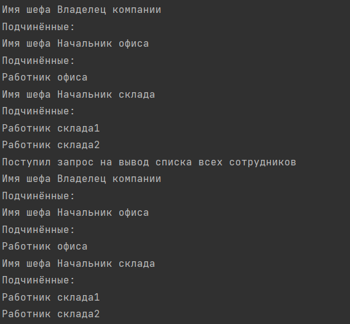

В работе использованы два паттерна: Composite и Observer

Images - папка с изображениями
Src - папка с файлами проекта

Cитуация:
У нас есть иерархичная структура в компании N
Каждый сотрудник может либо иметь у себя подчинённых, либо же не иметь
Появляется какая-то служба безопастности, которая следит за тем, 
когда выводят список всех сотрудников у какой-то компании

Иерархическая структура построенна с помощью паттерна Composite
Есть шеф, есть рабочий

Наблюдатель за каким-то процессом выполнен с помощью паттерна Observer
Есть СБ, которая отслеживает момент выведения списка сотрудников

